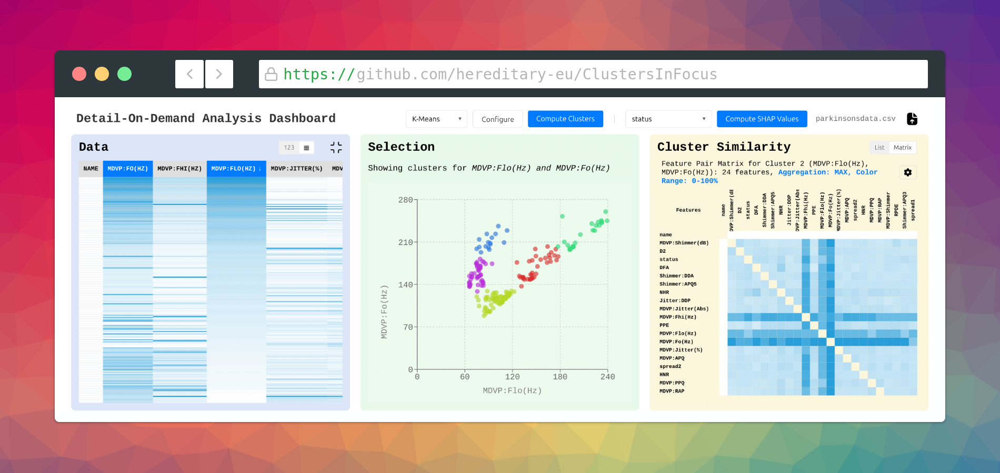

# Clusters in Focus

[](https://doi.org/10.2312/vcbm.20251250)

Welcome to the code behind _Clusters in Focus: A Simple and Robust Detail-On-Demand Dashboard for Patient Data_!
This work was presented at the EG [VCBM 2025](https://conferences.eg.org/vcbm2025/) at TU Delft.

Available on the [EG Digital Library](https://diglib.eg.org/items/3d093c70-1cde-43a1-894b-d1ac41f22903)
(including a direct link to the [PDF file](https://diglib.eg.org/server/api/core/bitstreams/3562c219-0d2c-49f7-bbef-d5c63fbe1a70/content)).



Exploring tabular datasets to understand how different feature pairs partition data into meaningful cohorts is crucial in domains such as biomarker discovery, yet comparing clusters across multiple feature pair projections is challenging.
We introduce _Clusters in Focus_, an interactive visual analytics dashboard designed to address this gap.

Clusters in Focus employs a three-panel coordinated view: a $\color{7593e6}\text{Data Panel}$ offers multiple perspectives (tabular, heatmap, condensed with histograms / SHAP values) for initial data exploration; a $\color{9ee5a1}\text{Selection Panel}$ displays the 2D clustering (K-Means / DBSCAN) for a user-selected feature pair; and a novel $\color{f3db70}\text{Cluster Similarity Panel}$ featuring two switchable views for comparing clusters.
A ranked list enables the identification of top-matching feature pairs, while an interactive similarity matrix with reordering capabilities allows for the discovery of global structural patterns and groups of related features.
This dual-view design supports both focused querying and broad visual exploration.

A use case on a Parkinson's disease speech dataset demonstrates the tool's effectiveness in revealing relationships between different feature pairs characterizing the same patient subgroup.

To run the application:

```bash
docker compose build
docker compose up
```

This will start a webserver (on port 80), which you can access via your browser.
In order to recreate the screenshot above and in the paper (Figure 1), open Firefox on `http://localhost`.
You should now be able to see the interface.
On the top right dropdown, select `parkinsonsdata.csv`, which should already be available within the pre-loaded database.

You should now be able to see a tabular view of the data.
In order to get to the heatmap view, click on the list icon in the top-right corner of $\color{7593e6}\text{Panel 1}$ (the $\color{7593e6}\text{Data Panel}$).

Now for example, select the two columns `MDVP:FO(HZ)` and `MDVP:FLO(HZ)`.
$\color{9ee5a1}\text{Panel 2}$ should display a scatter plot of all entries within the dataset across these two features.

Click on one of the data points to open $\color{f3db70}\text{Panel 3}$ and you will be presented with a similarity analysis of all other possible clusters within the same dataset which share a high overlap of entries.
This similarity is based on the Jaccard Index $J \in [0, 1]$, which measures the overlap in data point membership

$$J = \frac{\left| C_{AB} \cap C_{XY:k} \right|}{\left| C_{AB} \cup C_{XY:k} \right|}.$$

You can switch between a list and matrix view, again on the top right.
The colored intensities there correspond to a high Jaccard Index, enabling a robust workflow for cluster re-identification.

## Example Dataset

For the presentation and demonstration of an exemplary use case, we used the following dataset:

https://www.kaggle.com/datasets/debasisdotcom/parkinson-disease-detection/data

## Citation

If you found this tool helpful for your work, please cite it as follows:

```bibtex
@inproceedings{2025-clusters-in-focus,
	booktitle = {Eurographics Workshop on Visual Computing for Biology and Medicine},
	editor    = {Garrison, Laura and Krueger, Robert},
	title     = {{Clusters in Focus: A Simple and Robust Detail-On-Demand Dashboard for Patient Data}},
	author    = {Schilcher, Lukas and Waldert, Peter and Kantz, Benedikt and Schreck, Tobias},
	year      = {2025},
	publisher = {The Eurographics Association},
	issn      = {2070-5786},
	isbn      = {978-3-03868-276-9},
	doi       = {10.2312/vcbm.20251250}
}
```
